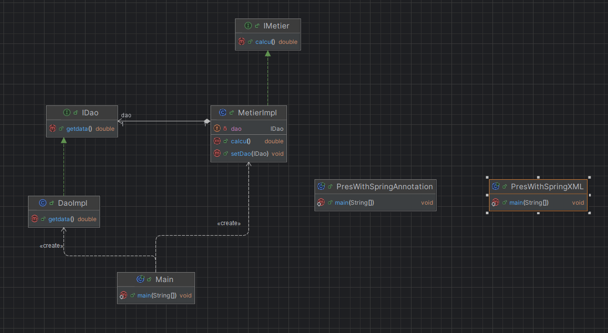
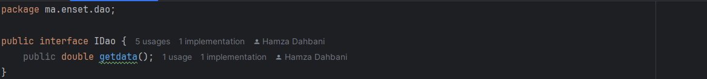
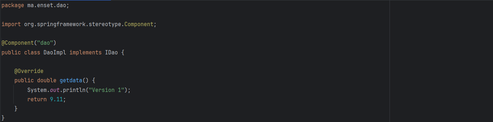
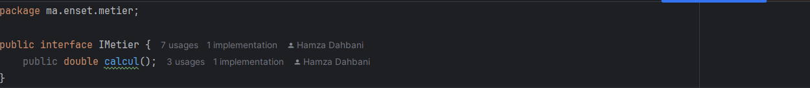
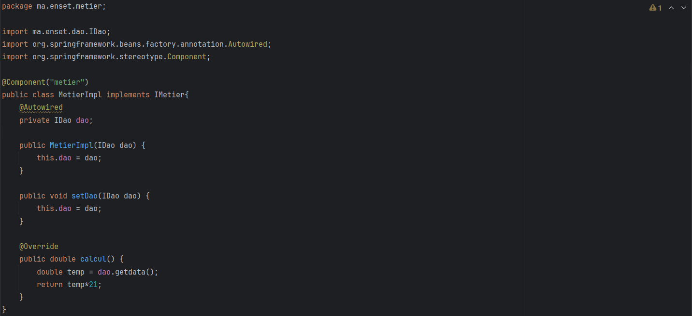
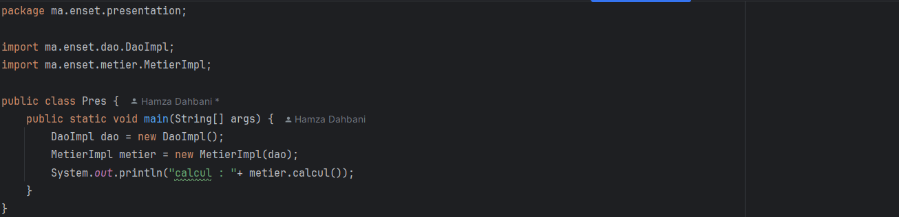
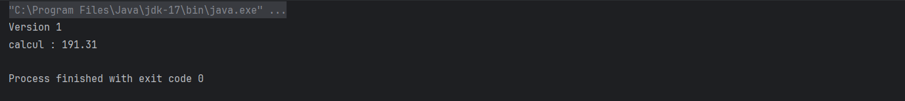
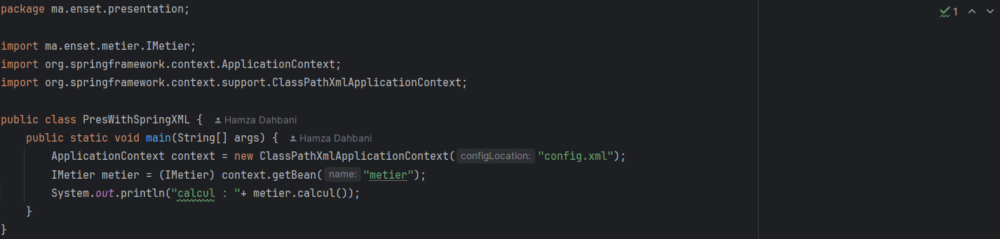
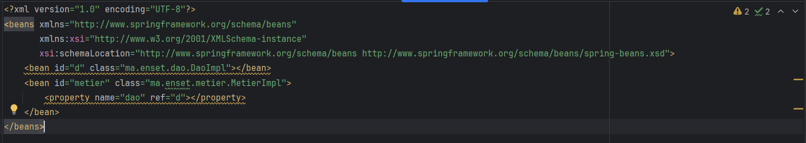
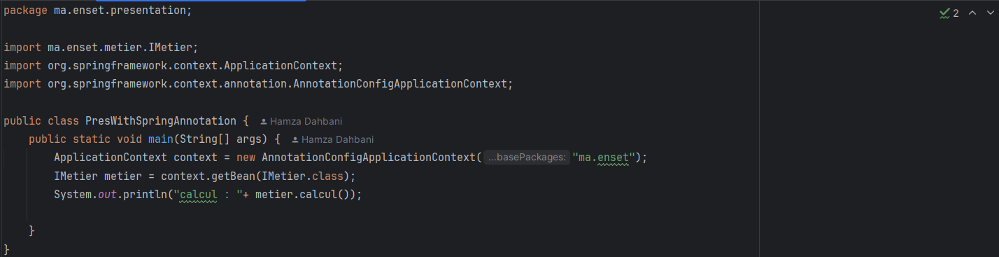

# Injection des Dépendances
## 1. Diagramme de classes

## 2. L'interface IDao

## 3. Implémentation de l'interface IDao

## 4. L'interface IMetier

## 5. Implémentation de l'interface IMetier

## 6. L'Injection des Dépendances

### a. Par instanciation statique
Dans cette approche, Injection des dépendances par instanciation Statique via le setter ou Constructeur

**Résultat :**

### b. En utilisant le Framework Spring
**Version XML :**

**Fichier de Config XML :**

**Version Annotations :**

